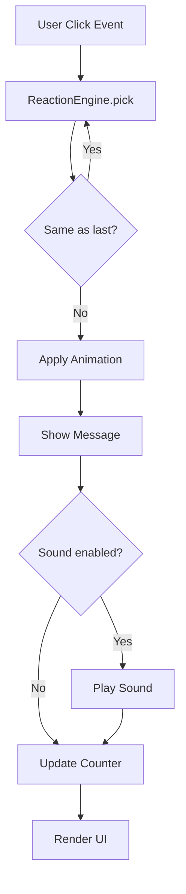

# Design Document: Cat Clicker App

## Overview

The Cat Clicker App is a self-contained, single-page web application delivered as one HTML file. There is no server, no build pipeline, and no external runtime dependencies beyond the Tailwind CSS CDN. All application state is held in memory for the duration of the browser session.

The core interaction loop is:

1. User clicks the cat.
2. The Reaction Engine selects a random, non-repeating reaction from the pool.
3. The selected reaction triggers an animation on the cat element, displays a message, and optionally plays a sound.
4. The click counter increments and the updated value is rendered.

The design favours simplicity: one module per concern, no bundler, plain ES2020 syntax, and Tailwind utility classes for all layout and visual styling.

---

## Architecture

The application is entirely client-side. Because there is no build step, the architecture is a flat, module-like organisation of JavaScript inside a single `<script>` tag.



**Responsibilities by concern:**

| Concern | Where |
|---|---|
| HTML structure / layout | `<body>` markup with Tailwind classes |
| Reaction data | `REACTION_POOL` constant array |
| Animation definitions | CSS `@keyframes` + utility class toggling |
| Reaction Engine logic | `ReactionEngine` object literal |
| Sound playback | `SoundPlayer` object literal (Web Audio API) |
| Counter & session state | `AppState` object literal |
| DOM wiring / event handlers | `init()` function called on `DOMContentLoaded` |

---

## Components and Interfaces

### 1. `REACTION_POOL` — Reaction Data

A frozen array of at least 8 reaction objects. Each reaction is plain data with no methods.

```
ReactionItem {
  id:        string        // unique identifier, e.g. "bounce-meow"
  message:   string        // text shown in Message_Display
  animation: AnimationKey  // key into ANIMATION_MAP
  soundKey:  SoundKey | null  // key into SOUND_MAP, or null
}
```

Minimum 8 entries required. Example entries:
- `{ id: "bounce-meow", message: "Meow!", animation: "bounce", soundKey: "meow" }`
- `{ id: "shake-hiss", message: "Don't touch me!", animation: "shake", soundKey: "hiss" }`
- `{ id: "spin-purr", message: "Spinning with joy~", animation: "spin", soundKey: "purr" }`

### 2. `ANIMATION_MAP` — Animation Registry

Maps `AnimationKey` strings to CSS class names that trigger `@keyframes` animations.

```
AnimationKey = "bounce" | "shake" | "spin" | "pulse" | "flip"
ANIMATION_MAP: Record<AnimationKey, string>  // e.g. { bounce: "anim-bounce", ... }
```

Animations are CSS classes applied to the cat element. Each class references a `@keyframes` rule with `animation-duration: ≤1000ms`. To restart an animation mid-flight the class is removed, a forced reflow is triggered (`element.offsetWidth`), and the class is re-added.

### 3. `SOUND_MAP` — Sound Registry

Maps `SoundKey` strings to inline base64-encoded audio data URIs (short `.wav` or `.mp3` clips ≤4KB each). Using data URIs keeps the app self-contained and working under `file://` without CORS issues.

```
SoundKey = "meow" | "hiss" | "purr" | "chirp" | ...
SOUND_MAP: Record<SoundKey, string>  // data:audio/wav;base64,...
```

### 4. `AppState` — Session State

Plain mutable object holding all runtime state.

```
AppState {
  clickCount:    number   // starts at 0
  lastReactionId: string | null  // id of most recently played reaction
  soundEnabled:  boolean  // starts as false
}
```

No persistence; state resets on page reload.

### 5. `ReactionEngine` — Core Logic

Object literal with three methods:

```
ReactionEngine {
  pick(): ReactionItem
    // Returns a random reaction that is different from AppState.lastReactionId.
    // Uniform distribution across all other items.

  execute(reaction: ReactionItem): void
    // Applies animation, sets message, plays sound if enabled.

  reset(): void
    // Clears lastReactionId. Used when counter is reset.
}
```

`pick()` uses `Math.random()` to select uniformly from the pool after filtering out the previous reaction. This guarantees no consecutive repeat while preserving uniform distribution over the remaining N-1 items.

### 6. `SoundPlayer` — Audio Playback

```
SoundPlayer {
  play(soundKey: SoundKey): void
    // Creates a new Audio object from SOUND_MAP[soundKey] and calls .play().
    // Safe to call even if soundKey is null (no-op).

  isEnabled(): boolean
  setEnabled(val: boolean): void
}
```

Creating a new `Audio` instance per play is intentional: it allows overlapping sounds (rapid clicking) without needing to reset `currentTime`, and avoids shared state issues.

### 7. `init()` — Bootstrap Function

Called once on `DOMContentLoaded`. Responsibilities:

- Query DOM references for cat element, message display, counter display, sound toggle, reset button.
- Attach click handler to cat → calls `ReactionEngine.pick()` then `ReactionEngine.execute()`, increments `AppState.clickCount`, updates counter display.
- Attach change handler to sound toggle → updates `SoundPlayer.setEnabled()`.
- Attach click handler to reset button → resets `AppState.clickCount` to 0, clears message display, calls `ReactionEngine.reset()`, updates counter display.

---

## Data Models

### Reaction Object (runtime)

```js
const REACTION_POOL = Object.freeze([
  { id: "bounce-meow",   message: "Meow!",                animation: "bounce", soundKey: "meow"  },
  { id: "shake-hiss",    message: "Don't touch me!",      animation: "shake",  soundKey: "hiss"  },
  { id: "spin-purr",     message: "Spinning with joy~",   animation: "spin",   soundKey: "purr"  },
  { id: "pulse-chirp",   message: "Chirp chirp!",         animation: "pulse",  soundKey: "chirp" },
  { id: "flip-yawn",     message: "Ugh, you woke me up.", animation: "flip",   soundKey: null    },
  { id: "bounce-blink",  message: "Blink blink...",       animation: "bounce", soundKey: null    },
  { id: "shake-grumpy",  message: "I was napping!",       animation: "shake",  soundKey: "hiss"  },
  { id: "spin-happy",    message: "Wheeee!",              animation: "spin",   soundKey: "purr"  },
]);
```

### AppState (runtime)

```js
const AppState = {
  clickCount: 0,
  lastReactionId: null,
  soundEnabled: false,
};
```

### Animation Keyframes (CSS, inline in `<style>`)

```css
@keyframes anim-bounce {
  0%, 100% { transform: translateY(0);    }
  40%       { transform: translateY(-30px); }
  70%       { transform: translateY(-15px); }
}
@keyframes anim-shake {
  0%, 100% { transform: rotate(0deg);  }
  20%       { transform: rotate(-8deg); }
  60%       { transform: rotate(8deg);  }
  80%       { transform: rotate(-4deg); }
}
@keyframes anim-spin {
  from { transform: rotate(0deg);   }
  to   { transform: rotate(360deg); }
}
@keyframes anim-pulse {
  0%, 100% { transform: scale(1);   }
  50%       { transform: scale(1.3); }
}
@keyframes anim-flip {
  0%   { transform: rotateY(0deg);   }
  50%  { transform: rotateY(180deg); }
  100% { transform: rotateY(360deg); }
}
```

All animations use `animation-duration: 600ms` with `animation-fill-mode: forwards` so the cat snaps back to default when the class is removed on `animationend`.

### Layout (Tailwind utility classes, key elements)

```
<body class="min-h-screen bg-amber-50 flex flex-col items-center justify-center gap-6 p-4">
  <!-- Counter bar (always visible) -->
  <div id="counter-bar" class="fixed top-0 inset-x-0 flex justify-between items-center px-6 py-2 bg-white/80 backdrop-blur shadow text-sm font-semibold">
    <span>Clicks: <span id="click-count">0</span></span>
    <div class="flex gap-3 items-center">
      <label class="flex items-center gap-1 cursor-pointer">
        <input id="sound-toggle" type="checkbox" class="accent-amber-500">
        <span>Sound</span>
      </label>
      <button id="reset-btn" class="px-3 py-1 rounded bg-amber-200 hover:bg-amber-300 transition">Reset</button>
    </div>
  </div>

  <!-- Cat -->
  <div id="cat" class="cursor-pointer select-none text-[10rem] leading-none mt-16" role="button" aria-label="Click the cat" tabindex="0">
    🐱
  </div>

  <!-- Message Display -->
  <div id="message-display" class="min-h-[2rem] text-xl font-medium text-amber-800 text-center px-4"></div>
</body>
```

---

## Correctness Properties

*A property is a characteristic or behavior that should hold true across all valid executions of a system — essentially, a formal statement about what the system should do. Properties serve as the bridge between human-readable specifications and machine-verifiable correctness guarantees.*

### Property 1: Click counter increments monotonically

*For any* sequence of N clicks (N ≥ 1), the click counter value after those clicks SHALL equal its value before plus N.

**Validates: Requirements 2.3, 2.4, 6.1**

---

### Property 2: Reaction selection never repeats consecutively

*For any* sequence of at least 2 clicks, no two adjacent reactions in the resulting sequence SHALL share the same reaction id.

**Validates: Requirements 3.3**

---

### Property 3: Reaction selection is uniform over non-previous reactions

*For any* reaction pool of size N and any previous reaction id, the `pick()` function SHALL select uniformly at random from the remaining N-1 reactions (all ids except the previous one have equal probability over a sufficiently large sample).

**Validates: Requirements 3.2, 3.3**

---

### Property 4: Counter reset returns to zero

*For any* click count value C (including 0), activating the Reset control SHALL set the click counter to exactly 0.

**Validates: Requirements 6.3, 6.4**

---

### Property 5: Sound toggle gates playback

*For any* reaction with a non-null sound key, when sound is disabled the sound SHALL NOT be played, and when sound is enabled the sound SHALL be played.

**Validates: Requirements 5.1, 5.3, 5.4, 5.5**

---

### Property 6: Reaction execution applies correct message and animation

*For any* reaction in the pool, executing that reaction SHALL set the message display to exactly that reaction's message string AND apply exactly that reaction's animation class to the cat element.

**Validates: Requirements 3.4, 3.5**

---

### Property 7: Animation restart on rapid click

*For any* animation in progress, a second click before the animation completes SHALL restart that animation from its initial frame (the animation class is removed, reflow forced, class re-applied).

**Validates: Requirements 4.3**

---

## Error Handling

| Scenario | Handling |
|---|---|
| `Math.random()` edge case (pool size 1) | `pick()` returns the sole item (no repeat check possible; degenerate pool) |
| `Audio.play()` returns rejected Promise (autoplay policy) | Caught silently; no error surfaced to user |
| `soundKey` is `null` | `SoundPlayer.play(null)` is a no-op — early return |
| Animation class not found | No visual change; cat remains in idle state; console.warn emitted |
| `animationend` never fires (e.g., `prefers-reduced-motion`) | A `setTimeout(cleanup, 1100)` fallback removes the animation class |
| Reset during animation | Animation class removed immediately; cat returns to idle |

### `prefers-reduced-motion` support

```css
@media (prefers-reduced-motion: reduce) {
  #cat [class*="anim-"] {
    animation-duration: 0.01ms !important;
  }
}
```

This honours the user's OS accessibility setting while still completing the animation cycle (so `animationend` fires and state is cleaned up correctly).

---

## Testing Strategy

### Assessment: Is PBT Appropriate?

This feature is a single HTML file with vanilla JavaScript containing pure functions (`ReactionEngine.pick`, counter arithmetic, sound-gating logic). Several of these are pure or near-pure functions where behaviour varies meaningfully with input and 100+ iterations will surface edge cases. PBT **is appropriate** for the logic layer.

The UI rendering portions (Tailwind classes, DOM structure) are not suitable for PBT; snapshot / visual tests are used there instead.

**Chosen PBT library:** [fast-check](https://github.com/dubzzz/fast-check) (MIT) — runs in plain Node.js with no bundler, making it compatible with this project's zero-build-step philosophy when tests are run via `node --experimental-vm-modules`.

---

### Unit Tests

Scope: specific examples, edge cases, error conditions.

| Test | Covers |
|---|---|
| Counter starts at 0 | Req 6.1 |
| Counter is 0 after reset regardless of prior count | Req 6.3 |
| Message display clears after reset | Req 6.4 |
| Sound is disabled by default | Req 5.5 |
| `SoundPlayer.play(null)` does not throw | Error handling |
| Pool contains ≥ 8 items with distinct ids | Req 3.1 |
| 5 distinct animation keys exist in `ANIMATION_MAP` | Req 4.1 |
| Animation class is removed after `animationend` | Req 4.4 |
| Sound toggle checkbox reflects `AppState.soundEnabled` | Req 5.2 |

---

### Property-Based Tests

Each test runs **minimum 100 iterations** via fast-check. Each test is tagged with a comment in the format:  
`// Feature: cat-clicker-app, Property <N>: <property text>`

| Property | Test description |
|---|---|
| **Property 1** | Generate random N (1–1000), simulate N clicks, assert counter equals N |
| **Property 2** | Generate random click sequence length (2–200), run `pick()` repeatedly, assert no two consecutive results share an id |
| **Property 3** | For each reaction as the "previous", run `pick()` 500 times, assert previous id never appears and distribution is approximately uniform |
| **Property 4** | Generate random C (0–10000), set counter to C, reset, assert counter is 0 |
| **Property 5** | Generate random (soundEnabled: boolean, soundKey: string | null), assert `SoundPlayer` calls `Audio.play()` iff `soundEnabled && soundKey !== null` |
| **Property 6** | Generate random reaction from pool, call `execute()`, assert message display text equals reaction.message and cat classList contains the correct animation class |
| **Property 7** | Simulate rapid double-click, assert animation CSS class was re-applied (removed then added) |

---

### Integration / Smoke Tests

Performed manually in a browser (or with Playwright if automated):

- Open `index.html` via `file://` protocol — page loads, no console errors.
- Click cat 10 times — reactions vary, counter increments, no horizontal scroll.
- Toggle sound on, click cat — audio plays without error.
- Resize viewport to 320px and 2560px — layout remains intact, no overflow.
- Click Reset — counter resets to 0, message clears.
- Enable "prefers-reduced-motion" in OS — animations complete instantly, no broken state.
